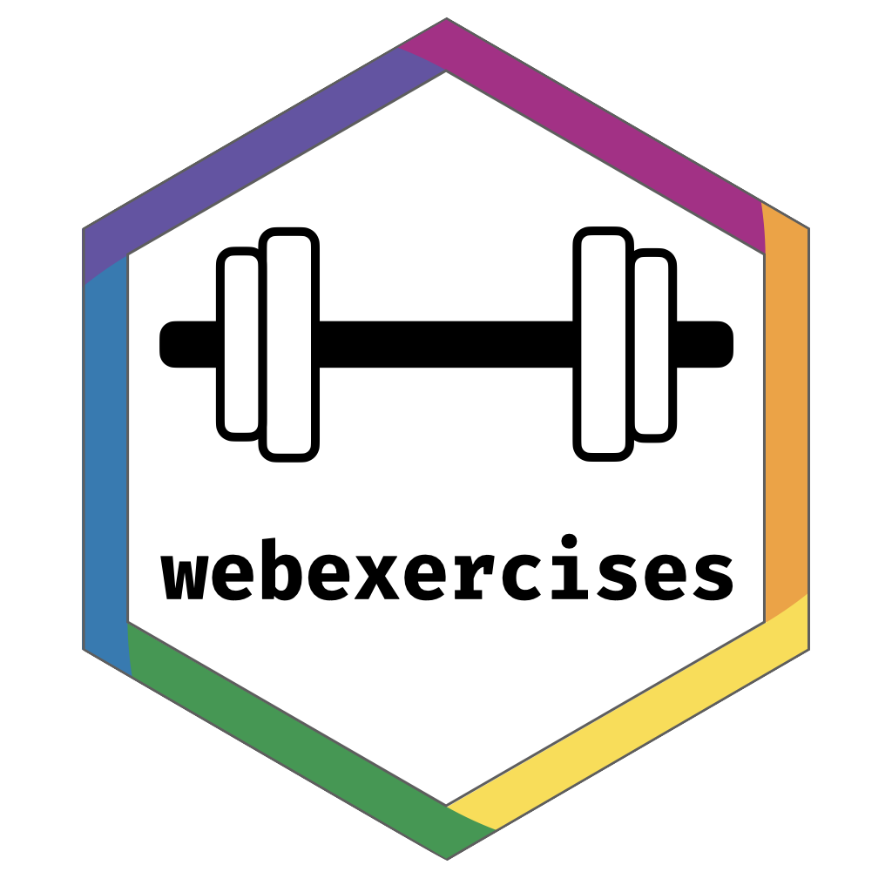

<!-- README.md is generated from README.Rmd. Please edit that file -->

# Fork details

This fork adds in the ability to provide an optional 'feedback' argument to all question types. 

Feedback will display after the question, and will only appear when one of the options is chosen. 


The intention is to tidy up the approach and finish updating relevant documentation, as well as testing within rmd (currently only tested within Quarto), then submit this as a pull request to the main library. 

The `webexercises` document that is automatically added to a project through the `add_to_quarto()` function has been updated to include examples of the feedback parameter for all question types.

### Examples

``` r
- What has changed in the year 3000? `r mcq(opts=c(answer = "Not much, but they live underwater", "Everything", "Nothing - I can't believe they don't have hoverboards yet"), feedback=c("", "Go and listen to the definitive song on the subject and report back!", "Wait, really? They don't? Well, that's thoroughly disappointing."))`
```

``` r
True or False? The month of April has 31 days. `r torf(FALSE, c("That's not quite right. Remember the rhyme - 30 days has September, *April* June and November!", "Well done! April - along with September, June and November - has 30 days. February has 28 or 29 (depending on whether it's a leap year), and the rest have 31."))`
```

### Installing this fork

You can install this fork from GitHub with:

``` r
devtools::install_github("Bergam0t/webexercises")
```

# The `{webexercises}` package



The goal of `{webexercises}` is to enable instructors to easily create
interactive web pages that students can use in self-guided learning.
Although `{webexercises}` has fewer features than RStudio’s
[learnr](https://rstudio.github.io/learnr/) package, it is more
lightweight: whereas `{learnr}` tutorials must be either hosted on a
shiny server or run locally, `{webexercises}` creates standalone HTML
files that require only a JavaScript-enabled browser. It is also
extremely simple to use. See the [webexercises
website](https://psyteachr.github.io/webexercises/) for demos and
instructions.

## Installation

You can install `{webexercises}` from CRAN using:

``` r
install.packages("webexercises")
```

You can install the development version from
[GitHub](https://github.com/PsyTeachR/webexercises) with:

``` r
devtools::install_github("psyteachr/webexercises")
```

<a rel="license" href="https://creativecommons.org/licenses/by-sa/4.0/"></a><br />This
work is licensed under a
<a rel="license" href="https://creativecommons.org/licenses/by-sa/4.0/">Creative
Commons Attribution-ShareAlike 4.0 International License</a>.
